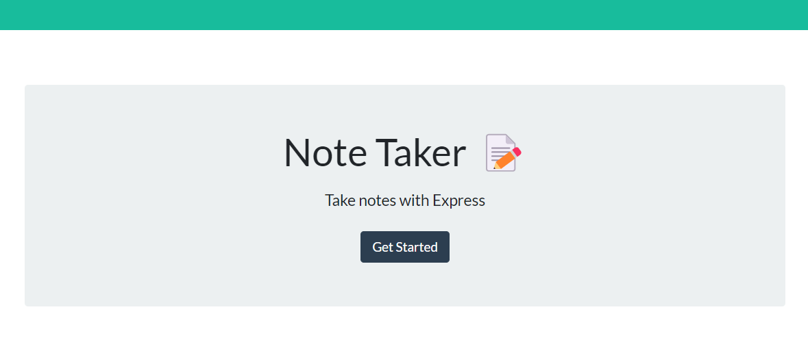

  

---

# Note Taker Application

## Description



This is a note taking application that allows users to create, save, and delete notes. This application uses an express backend and saves and retrieves note data from a JSON file. This application is deployed on Heroku.

---

## Table of Contents

- [Installation](#installation)
- [Usage](#usage)
- [Credits](#credits)
- [License](#license)
- [Contributing](#contributing)
- [Tests](#tests)
- [Questions](#questions)

---

## Installation

Installation is required to run the application locally. To install the application, run the following command:

```bash
npm install
```

You can also skip the installation run the application by clicking on the following link: <https://youngs-note-taker.herokuapp.com/>

---

## Usage

This application is deployed on Heroku. You can access the application by clicking on the following link: <https://youngs-note-taker.herokuapp.com/>

You can also run the application locally by running the following command after local installation:

```bash
npm start
```

Then, open your browser and go to <http://localhost:3001/>

---

## License

This project is licensed under the ISC license. Please see LICENSE.md for more information.

---

## Credits

Starter code was provided by the University of California Berkeley Coding Boot Camp. Great staff members and TAs at the boot camp helped me with this project.

Special thanks to Jili Jiang (a tutor) for helping me with this project! She is a great tutor and I highly recommend her!

---

## Contributing

For contributions, please create a new branch of the project and submit a pull request. Any contributions are greatly appreciated. Issues can be submitted in the issues section of the repo or by emailing me directly (see Questions section below).

---

## Tests

Test feature is not available for this application.

---

## Questions

If you have any questions about the repo, open an issue or contact me directly at:

Github: [jyoungjoon](https://github.com/jyoungjoon)

Email: <lifescriptified@gmail.com>

---
